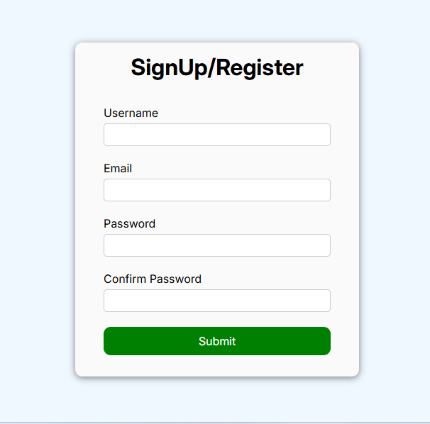
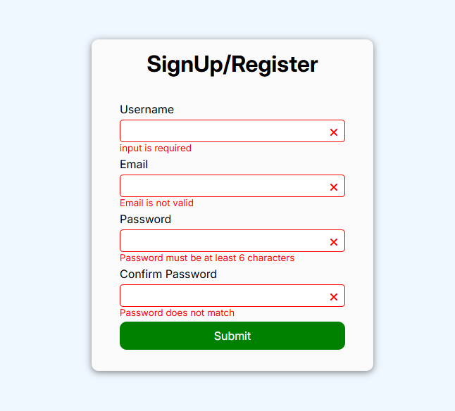

# 📝 Form Validation Project

This is a basic **Form Validation** project using HTML, CSS, and JavaScript. It demonstrates real-time client-side form validation with clear user feedback and styled UI components.

## ✨ Features

- ✅ Username, email, password, and confirm password fields  
- ⏱️ Real-time validation  
- ❗ Required field checks  
- 📧 Valid email pattern  
- 🔐 Password length between 6 and 10 characters  
- 🔁 Password confirmation matching  
- ✅ Visual feedback with icons using Font Awesome  
- 🎨 Styled with custom CSS  
- 📱 Responsive layout  

## 🧰 Technologies Used

- HTML5  
- CSS3  
- JavaScript (ES6)  
- Font Awesome (CDN)  

## 📸 Screenshots

Below are some screenshots of the form validation in action:

### 🖥️ Screen 1 - Initial Form View


### ✅ Screen 2 -  Validation Errors


### ❌ Screen 3 - Successful Validation 


## 🚀 Getting Started

1. Clone this repository:

```bash
git clone https://github.com/yourusername/form-validation.git
